# Architecture

EdgeStack separates immutable evidence from mutable orchestration state. Market
payloads and research artifacts are content-addressed files; SQLite records which
artifact a campaign may consume next. DuckDB is a read-only analytical engine over
canonical Parquet and is never the source of campaign truth.

```mermaid
flowchart LR
    subgraph providers[External sources]
        T[Tiingo]
        S[Stooq]
        Y[Yahoo]
        U[Universe and event schedules]
        Q[Fresh quote source]
    end

    subgraph data[Data boundary]
        A[Provider adapters]
        R[(Immutable raw payloads)]
        N[Normalize and QA]
        P[(Partitioned canonical Parquet)]
        M[(SQLite WAL catalog)]
    end

    subgraph research[Research boundary]
        C[CausalDataView]
        F[Features and hypothesis grammar]
        B[Chunked NumPy sweep and costs]
        X[HAC, bootstrap, FDR, DSR, SPA]
        V[Walk-forward, CPCV, PBO, decay]
        Z[Independent finalist confirmation]
        E[(Immutable evidence bundles)]
    end

    subgraph promotion[Promotion boundary]
        RP[Provisional report]
        ST[Bayes shrinkage and clustered stack]
        FR[Freeze manifest]
        HG{{Single-use holdout guard}}
        RF[Final report]
    end

    subgraph paper[Paper-only assistant]
        SC[08:30 ET scanner]
        MO[Intraday revalidation monitor]
        LS[(Recommendation ledger)]
        OB[(Transactional outbox)]
        AL[Console, SMTP, Telegram, webhook]
    end

    T --> A
    S --> A
    Y --> A
    U --> A
    A --> R --> N --> P
    N --> M
    P --> C --> F --> B --> X --> V --> Z --> E
    M -. gate state .-> F
    M -. gate state .-> B
    M -. gate state .-> V
    E --> RP --> ST --> FR --> HG --> RF
    M -. atomic authorization .-> HG
    FR -. promoted model only .-> SC
    P --> SC
    Q --> SC
    SC --> MO --> LS --> OB --> AL
    LS --> M
```



## Dependency rule

Lower layers must not import orchestration or presentation layers. Shared immutable
contracts live in `edgestack.models`; provenance hashing and storage primitives sit
below the research pipeline. The intended dependency direction is:

```text
models / provenance
        ↓
data → features → hypotheses → backtest → stats → validation → evaluation
        ↓                                             ↓
      storage ←──────────── pipeline gates ───────── report
                                                      ↓
                                      scoring → entrytiming → live
```

The package-level contracts are deliberately narrow:

- `DailyBarSource`, `QuoteSource`, and `UniverseSource` isolate provider behavior.
- `Feature.compute(CausalDataView)` makes the information boundary explicit.
- `SweepEngine.run`, `CostModel.estimate`, and `ConfirmationEngine.confirm` keep
  discovery, costs, and independent confirmation replaceable.
- `EvidenceBundle`, `VerdictRecord`, `StackArtifact`, `GateResult`, and
  `HoldoutFreezeManifest` are frozen hand-off objects, not mutable work tables.

## Causal time model

Every observation has two clocks:

- `event_time` is when the economic event or market print occurred.
- `available_at` is the earliest timestamp at which this system could have used it.

All joins are availability-time joins. `CausalDataView.as_of(t)` returns only rows
whose `available_at <= t`; constructing a view containing even one later row is an
error. Calendar schedules may be known in advance, but revisions and unscheduled
events receive their actual publication timestamp. A fill must be strictly later
than the signal's availability timestamp. This applies even if both timestamps
belong to the same civil date.

The test suite checks this contract by replaying every prefix of a recorded stream.
A valid feature produces the same historical value in prefix replay and in the
eventual full dataset. A deliberately forward-shifted feature fails that oracle.

## Storage and provenance

Raw HTTP bodies are append-only and addressed by SHA-256. A normalized snapshot
records provider, fetch time, market `as_of`, source content hashes, adjustment
capabilities, universe identity, warnings, configuration hash, seed, lock hash, and
source-tree hash. Raw and adjusted OHLCV remain separate so an adjustment cannot be
mistaken for an exchange print.

Canonical observations and large evidence tables are partitioned Parquet. SQLite
in WAL mode owns small transactional records: manifests, cache indexes, gate
results, holdout state, recommendation revisions, paper ledger entries, and outbox
events. An artifact is complete only after its content has been durably written and
its hash registered. Recovery may retry incomplete work, but it cannot overwrite a
registered immutable artifact under the same identity.

## Provider selection

Provider fallback operates on a whole instrument snapshot. Tiingo is selected when
credentials are configured; otherwise Stooq is tried before Yahoo. A failed or
incomplete provider may trigger a whole-series retry with the next provider, but
rows from different daily-bar providers are never spliced into one snapshot. The
20-symbol reconciliation gate deliberately compares independent Stooq and Yahoo
series rather than hiding disagreement through blending.

The versioned `action_stratified_returns` policy is available when Stooq bulk
levels and Yahoo total-return levels use incompatible historical adjustment
bases. It never averages or rewrites prices. Independent raw close returns are
compared on non-action sessions, while Yahoo's explicit dividend/split ledger is
checked for internal consistency with Yahoo adjusted returns on action sessions.
The same frozen tolerance and required fraction apply to both strata, and all
evidence carries `SINGLE_SOURCE_ACTIONS` because Stooq supplies no action ledger.

## Gates and holdout isolation

Each command reads the predecessor's persisted `GateResult`. Missing, failed, or
blocked evidence prevents the next phase from opening. A failure still writes a
diagnostic artifact and report; it does not silently relax thresholds.

The holdout is a separate trust boundary. A freeze manifest commits the edge IDs,
stack, costs, overlays, configuration, and input snapshot before access. SQLite
consumes the one-use authorization before the evaluator receives holdout data. One
job evaluates all frozen edges and their frozen composite, then seals the result
hash. Report regeneration reads that sealed artifact and does not reopen data.

## Paper-only state and delivery

The live layer never routes a broker order. A recommendation transition and its
logical alert are inserted in one SQLite transaction. The outbox gives exactly-once
logical event creation and retryable, at-least-once external delivery. External
channels may deliver duplicates, so every message carries stable recommendation,
revision, and event IDs. A consumer can therefore deduplicate safely after a crash
or restart.
